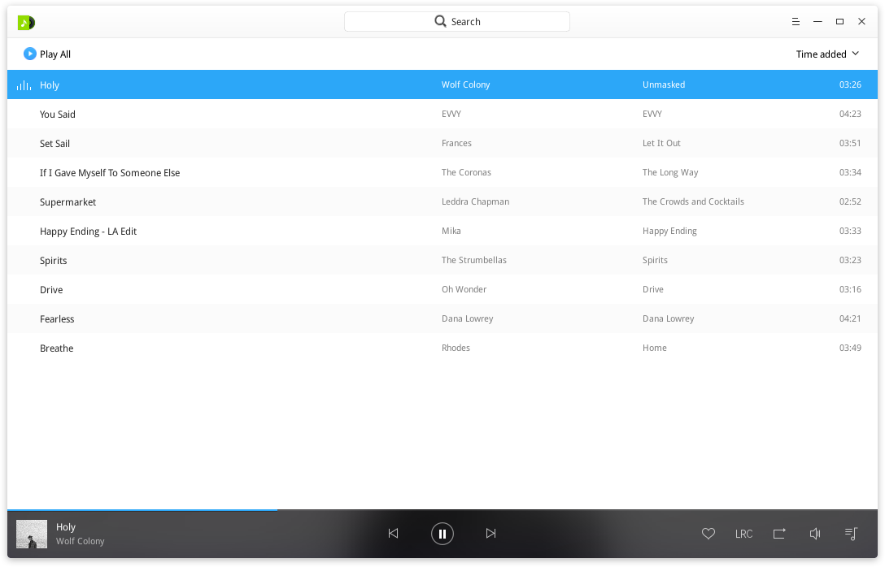
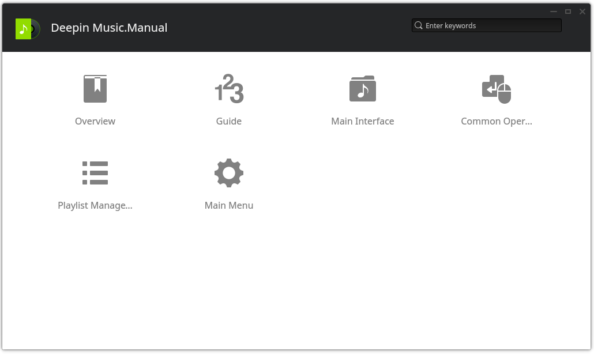
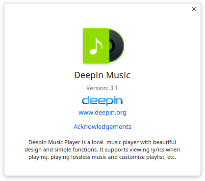

# Deepin Music|../common/deepin-music.svg|

## Overview|../common/icon_overview.svg|

Deepin Music is an application developed by Deepin Technology Team which focused on local music playing. It brings all brand new UI design, extreme playing experience, and it has local music scanning and lyric sync functions, etc.

## Guide|../common/icon_guide.svg|

You can run, close and create a shortcut for Deepin Music by the following ways.

### Run Deepin Music

1. Click on  or move the mouse pointer to the upper left corner of the screen to enter Launcher interface.
2. Locate  by scrolling mouse wheel or searching by "deepin music" in Launcher interface.
3. Right click on the Deepin Music application icon, you can
 - Click on **Send to desktop** to create a desktop shortcut.
 - Click on **Send to dock** to fix the application on dock.
 - Click on **Add to startup** to add the application to startup, it will automatically run when the system starts up.

> : If Deepin Music has docked on the dock, you can also click on the application icon to run Deepin Music.

### Exit Deepin Music

- In Deepin Music interface, click on  to exit Deepin Music.
- Right click on the Deepin Music application icon on the dock, select ** Close all ** to exit Music.
- Click on  and select ** Exit ** to exit Deepin Music.

## Main Interface|../common/icon_localmusic.svg|

By using the button on the main interface, user can do commn playing operations, viewing playlist and song info.

<table class="block1">
    <caption></caption>
    <tbody>
        <tr>
            <td>1</td>
            <td>Search box</td>
            <td>User can search music quickly by search box.</td>
        </tr>
        <tr>
            <td>2</td>
            <td>Main menu</td>
            <td>User can add playlist, add music, set options, view manual and  information, and exit the application by main menu.</td>
        </tr>
		<tr>
            <td>3</td>
            <td>Sort options</td>
            <td>User can sort the list by time added, title, artist or album name.</td>
        </tr>
		<tr>
            <td>4</td>
            <td>Play box</td>
            <td>Show now playing, cover and album name.</td>
        </tr>
			<tr>
            <td>5</td>
            <td>Play/Pause button</td>
            <td>Click to Play/Pause music.</td>
        </tr>
		<tr>
            <td>6</td>
            <td>Previous/Next</td>
            <td>Click to switch to Previous/Next music.</td>
        </tr>
		<tr>
            <td>7</td>
            <td>My favorites</td>
            <td>Click to add music to my favorites, click again to cancel.</td>
        </tr>
		<tr>
            <td>8</td>
            <td>Lyrics</td>
            <td>Click to switch to the Lyrics interface, click again to exit the interface.</td>
        </tr>
			<tr>
            <td>9</td>
            <td>Play mode</td>
            <td>Click to switch the play mode, including repeat list, repeat and shuffle.</td>
        </tr>
			<tr>
            <td>10</td>
            <td>Volume</td>
            <td>Click to Mute/Unmute, move on to show the volume bar to adjust.</td>
        </tr>
			<tr>
            <td>11</td>
            <td>Playlist</td>
            <td>Click to show/hide playlist.</td>
        </tr>
    </tbody>
</table>

## Common Operations|../common/icon_commoncoperat.svg|

User can add, delete and view info of the local music in Deepin Music.

### Add music

1. In Deepin Music interface, user can 
 - Click on  > ** Add music **.
 - Click on ** Add music ** on the initial main interface.
 - Click on ** Scan ** at the bottom of the initial main interface.
2. In the popup window, choose the file and folder to scan the music files, click on ** Add ** to confirm the operation.

### Search music

1. At the top of the Deepin Music interface, click on ** Search **.
2. in the search box, enter the keywords, the result will show on the main interface, user can locate the music quickly.

### Add music to my favorites

In Deepin Music interface, click on  to add music to my favorites playlist.

> : User can also right click on the music, click on ** Add to playlist ** > ** My Favorites ** to finish this task.

### Delete music

1. In Deepin Music interface, to delete a music from the playlist, right click on the music.
2. Click on ** Remove from playlist ** to remove the music from the playlist, the music file will still on the local disk.
3. Click on ** Delete from local disk ** to remove the music from the playlist and delete the music file from local disk. User should also confirm the operation in the popup window. 

### View music info

1. In Deepin Music interface, right click the music.
2. Click on ** Song info **, user can view the information of the music.

### Display in file manager

1. In Deepin Music interface, right click the music.
2. Click on ** Display in file manager **, user can view the the music file on file manager.

## Playlist Management|../common/icon_playlist.svg|

In Deepin Music interface, user can add, delete, rename playlist and add music to the playlist.
To show the playlist interface, click  on the bottom.

### Add playlist

1. To add a new playlist, user can
 - Click on ** Add playlist ** on the bottom of the playlist interface.
 - Click on  to enter ** Main Menu ** and click on ** New Playlist **.
 - Right click on the music and click on ** Add to playlist ** > ** New playlist **.
2. Enter the name of the playlist.
3. Click on the blank area of the Deepin Music to confirm the name.

### Play playlist

To play a existing playlist, user can
 - Double click on the playlist.
 - Right click on the playlist and select ** Play **.

### Rename playlist

1. To rename an existing playlist, right click on the playlist and select ** Rename **.
2. Enter the name of the playlist.
3. Click on the blank area of the Deepin Music to confirm the name.

### Add music to the playlist

To add a music to the playlist, right click on the music and click on ** Add to playlist ** 
 - Choose one of the existing playlist.
 - User can also choose ** New Playlist ** to add to a new playlist.

### Delete playlist

1. To delete an existing playlist, right click on the playlist and select ** Delete **.
2. In the popup window, select ** Delete ** to confirm the operation.

## Main Menu|../common/icon_optionsetting.svg|

In ** Main Menu **, user can add new playlists/songs, set the options, view information on Deepin Music and Exit the application.
In Deepin Music interface, click on  to enter ** Main Menu **.

### Settings

1. In ** Main Menu **, click on ** Settings **  to enter ** Settings **.
2. In ** Basic Settings **, user can:
   - Check ** Automatically play when startup **, to automatically play when Deepin Music startup.
   - Check ** Remember the last time when playing **, to play when the last time Deepin Music played.
   - Check ** Enable fade in and out **, to enable fade in and out when Deepin Music played/stopped.
   - Change ** Lyrics saving location **.
3. In ** Shortcuts Settings **, user can:
   - Redefine all shortcuts.
   - Click on ** Restore to default ** to restore all shortcuts to the default.

### Help

In ** Main Menu **, click on ** Help ** to view this manual.

### About

In ** Main Menu **, click on ** About ** to view the version and introduction of Deepin Music.

### Exit

In ** Main Menu **, click on ** Exit ** to exit Deepin Music.
